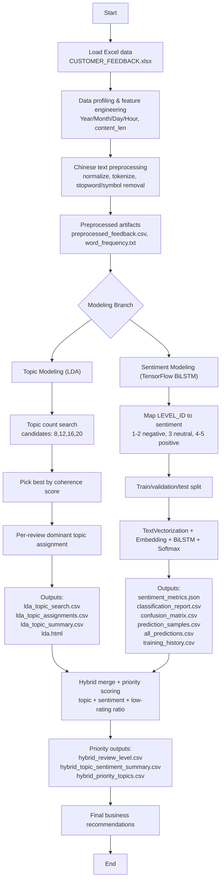

## Chinese Customer Feedback Intelligence

### Overview
This project turns large-scale Chinese customer feedback into actionable business insights by combining:
- **LDA topic modeling** for root-cause discovery
- **TensorFlow BiLSTM sentiment modeling** for severity scoring
- **Hybrid topic-sentiment ranking** for operational prioritization

### Business Goal
Identify what drives low customer ratings and produce a prioritized action list for store operations.

### Dataset
- Source: `data/CUSTOMER_FEEDBACK.xlsx`
- Rows: ~30,790
- Core columns:
  - `STORE_CODE`
  - `TRADE_ZONE`
  - `SURVEY_TIME`
  - `LEVEL_ID` (1-5)
  - `CONTENT_TX` (Chinese feedback text)

### Final Solution Choice
**Final production choice: Hybrid = LDA + TensorFlow BiLSTM Sentiment**

Why this is the final choice:
1. **LDA** explains *what customers complain/praise about* (diagnosis layer).
2. **Sentiment (BiLSTM)** quantifies *how severe each issue is* (severity layer).
3. **Hybrid merge** ranks topics by business risk (`negative_ratio + low_rating_ratio + volume`).

Model positioning:
- `LDA`: primary final model (theme extraction)
- `models/sentiment.py` (TensorFlow BiLSTM): primary final model (sentiment scoring)
- `models/tf_idf.py`: supporting analysis
- `models/word2vec.py`: supporting semantic exploration
- `models/LSTM.py` (standalone): not the final production path

### End-to-End Flow Diagram


### Project Structure
- `main.py`: orchestrates full pipeline + hybrid ranking
- `src/preprocess.py`: Chinese preprocessing and token-level cleaning
- `exploration/description.py`: EDA and visualization helpers
- `models/LDA.py`: topic modeling and coherence search
- `models/sentiment.py`: TensorFlow BiLSTM sentiment training/evaluation
- `models/tf_idf.py`, `models/word2vec.py`: supporting analysis models
- `data/`: source data and stopwords
- `output/`: generated artifacts
- `docs/`: project notes/templates

### Environment Setup
Recommended runtime for TensorFlow in this project: **Python 3.9**.

```bash
python3.9 -m venv .venv
source .venv/bin/activate
python -m pip install --upgrade pip
pip install -r requirements.txt
```

### Run Commands
Run full hybrid pipeline:
```bash
python3.9 main.py
```

Run only LDA branch:
```bash
python3.9 main.py --skip-sentiment
```

Run only sentiment branch:
```bash
python3.9 main.py --skip-lda
```

Customize topic search:
```bash
python3.9 main.py --topic-candidates 6,8,10,12,14
```

Customize hybrid priority list size:
```bash
python3.9 main.py --hybrid-priority-topn 15
```

### Final Outputs (Key Files)
Core EDA/processing:
- `output/analysis/data_profile.json`
- `output/analysis/preprocessed_feedback.csv`
- `output/analysis/word_frequency.txt`

LDA outputs:
- `output/analysis/lda_topic_search.csv`
- `output/analysis/lda_topic_assignments.csv`
- `output/analysis/lda_topic_summary.csv`
- `output/model_evaluation/lda.html`

Sentiment outputs:
- `output/analysis/sentiment_metrics.json`
- `output/analysis/sentiment_classification_report.csv`
- `output/analysis/sentiment_confusion_matrix.csv`
- `output/analysis/sentiment_prediction_samples.csv`
- `output/analysis/sentiment_all_predictions.csv`
- `output/analysis/sentiment_training_history.csv`
- `output/models/sentiment_tf.keras`

Hybrid final outputs:
- `output/analysis/hybrid_review_level.csv`
- `output/analysis/hybrid_topic_sentiment_summary.csv`
- `output/analysis/hybrid_priority_topics.csv`
- `output/analysis/pipeline_summary.json`

### How to Use the Final Result
1. Open `output/analysis/hybrid_priority_topics.csv` for top issue themes.
2. Use `negative_ratio`, `low_rating_ratio`, and `volume` to prioritize fixes.
3. Use `Topic_Keywords` + examples from `lda_topic_assignments.csv` to define concrete action plans.

