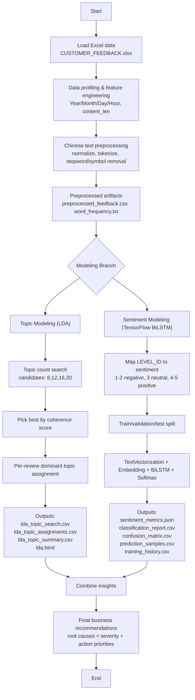

# Project Flow Diagram (v2)

```mermaid
flowchart TD
    A["Start"] --> B["Load Excel data<br/>CUSTOMER_FEEDBACK.xlsx"]
    B --> C["Data profiling & feature engineering<br/>Year/Month/Day/Hour, content_len"]
    C --> D["Chinese text preprocessing<br/>normalize, tokenize, stopword/symbol removal"]
    D --> E["Preprocessed artifacts<br/>preprocessed_feedback.csv, word_frequency.txt"]

    E --> F{"Modeling Branch"}

    F --> G["Topic Modeling (LDA)"]
    G --> G1["Topic count search<br/>candidates: 8,12,16,20"]
    G1 --> G2["Pick best by coherence score"]
    G2 --> G3["Per-review dominant topic assignment"]
    G3 --> G4["Outputs:<br/>lda_topic_search.csv<br/>lda_topic_assignments.csv<br/>lda_topic_summary.csv<br/>lda.html"]

    F --> H["Sentiment Modeling (TensorFlow BiLSTM)"]
    H --> H1["Map LEVEL_ID to sentiment<br/>1-2 negative, 3 neutral, 4-5 positive"]
    H1 --> H2["Train/validation/test split"]
    H2 --> H3["TextVectorization + Embedding + BiLSTM + Softmax"]
    H3 --> H4["Outputs:<br/>sentiment_metrics.json<br/>classification_report.csv<br/>confusion_matrix.csv<br/>prediction_samples.csv<br/>training_history.csv"]

    G4 --> I["Combine insights"]
    H4 --> I
    I --> J["Final business recommendations<br/>root causes + severity + action priorities"]
    J --> K["End"]
```

